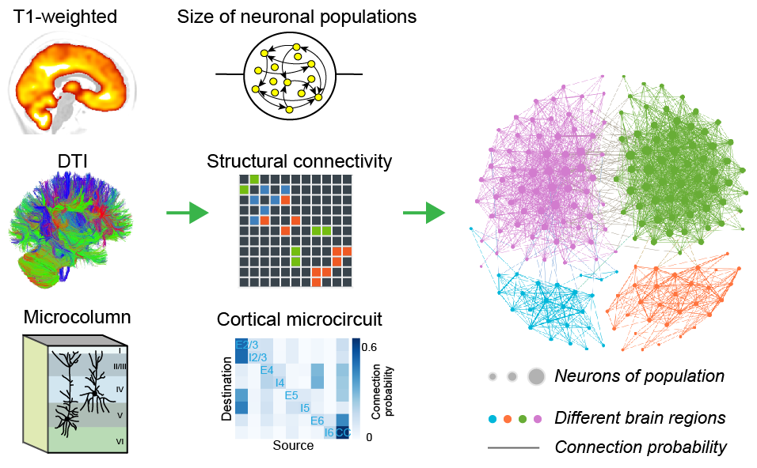
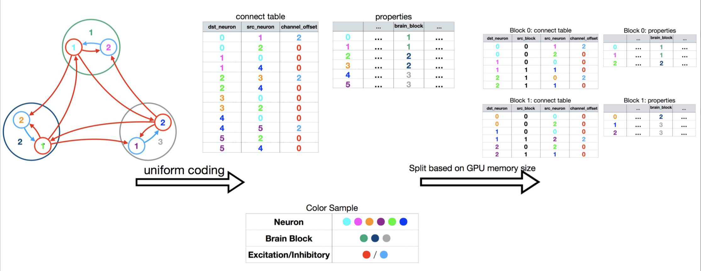
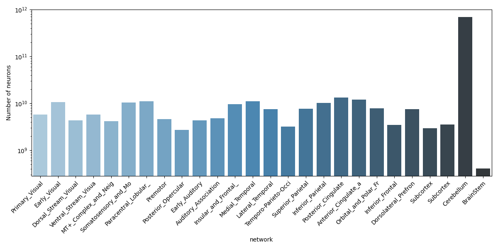
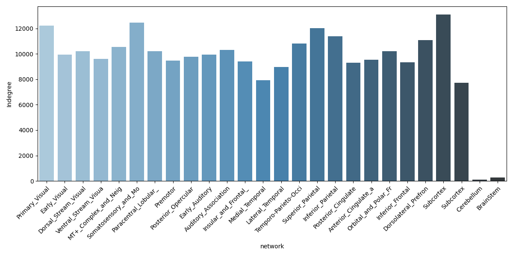
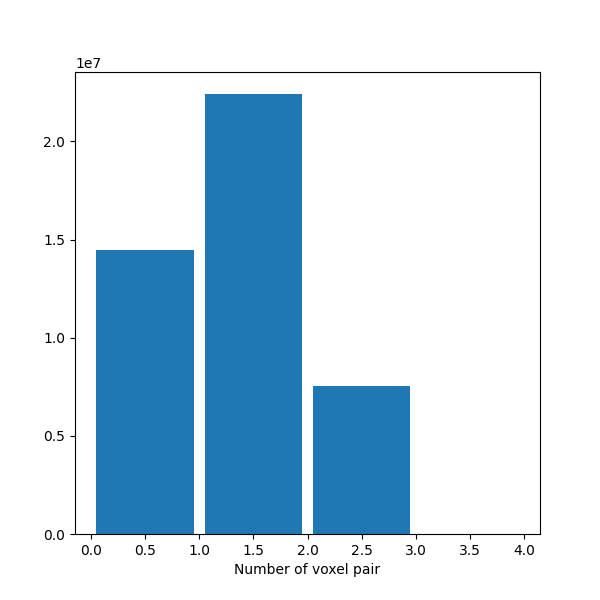

Model generation
=================
The whole brain neuronal network model presents the computational basis of the Digital twin brain and is composed of two components: the basic ``computing unites`` and the ``network structure``.

The basic computing units of the DTB are neurons and synapses, and the spike signal transmitted between neurons by synapses are action potentials, i.e., spikes. Each neuron model receives the postsynaptic currents as the input and describes the generating scheme of the time points of the action potentials as the output. The synapses have different models due to the diverse neurotransmitter receptors. The computational neuron is an integral unit of the received the presynaptic spikes from synapses as the input and generate spike trains as the output postsynaptic currents. The network model gives the synaptic interactions between neurons by a directed multiplex graph. Structural MRI images (i.e., diffusion weighted data and T1 weighted data) from biological brains are used to indirectly and partially measure the synaptic connections from neurons to neurons or from sub-regions to sub-regions.

Data preparation
-------------------
To build DTB, our commonly used biological data includes **DTI** and **T1** and incorporate the cortical circuit information if for the mircro-column version.
If other structural data is available, it can also be added to the model.

The structural information is used to build the graph of populations and the T1 information for determining the number of neurons inside each
population. The **functional fmri** including resting and tasking is playing a important role as a calibration criterion to make
the model more biological plausible.

Neuronal model
-----------------
Herein, we consider the leakage integrate-and-fire (LIF) model as neuron. A capacitance-voltage (CV) equation describes the membrane potential of neuron i,

.. math::
	\begin{array}{lr}
		C\dot{V_{i}} = -g_{L,i}(V_{i}-V_{L}) + I_{syn,i}+I_{ext,i}, & V_{i}<V_{th,i} \\
		V_{i} = V_{rest}, & t\in [t_{k}^{i}, t_{k}^{i} + T_{ref}]
	\end{array}
	\right.

and synaptic model

..math::
    I_{syn,i} = I_{AMPA,i} + I_{NAMDA,i} + I_{GABAa,i} + I_{GABAb,i}\\
	I_{u,i} = g_{u,i}(V_{i}^{u}-V_{i})J_{u,i}\\
	\dot{J_{u,i}} = -\dfrac{J_{u,i}}{\tau_{i}^{u}}+\sum_{k,j}w_{ij}^{u}\delta(t-t_{k}^{i})

Topology network
-----------------
In summary, we implement this network model based on an extension of k-random graph.

* Firstly, we set the number of neurons per population as equation.
* Secondly, for each neuron, according to its property (excitation or inhibitory neuron) and location (the voxel and/or layer if in a cortical voxel), we can calculate the number of synaptic links from each neuron population (the non-cortical voxel or the layer of the cortical voxel) defined in connection graph to this given neuron (Eqs. 5-7).
* Thirdly, we select each source neuron in that neuron population by equal probability without replacement iteratively.

Some hard setting:

1. Exc. / Inhi. = 4:1
2. inter-population connection is excitatory connection.
3. Average in-degree is 100 (neuron or voxel).

each node contain such property::

           noise_rate, blocked_in_stat, I_extern_Input, sub_block_idx, C, T_ref, g_Li, V_L, V_th, V_reset, g_ui, V_ui, tao_ui
      size:  1,   1,               1,                1,           1, 1,     1,    1,   1,    1,       4     4,    4
      dtype: f,   b,               f,                i,           f, f,     f,    f,   f,    f,       f,    f,    f

    b means bool(although storage as float), f means float.

Detailed code implementation
-----------------------------
Refer to ``generation`` and ``test``.

Results
-----------------------------
In light of employing SV2 A PET as the modeling paradigm to determine the number of synaptic connection per voxel, the ensuing outcomes are as follows.

Then we derive the average indegree for each voxel from different networks.

The spike transmission velocity is 100m/s, and we derive the synaptic delay for each voxel pair.

